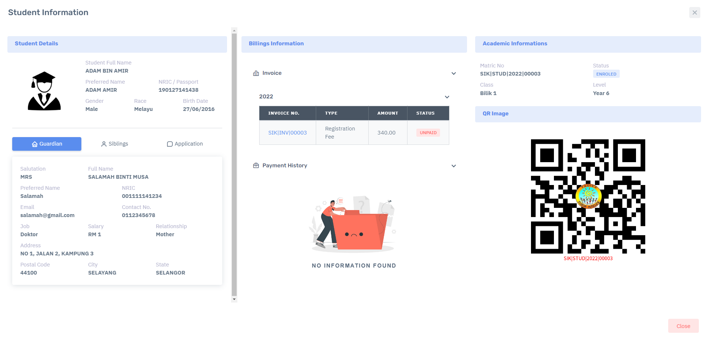
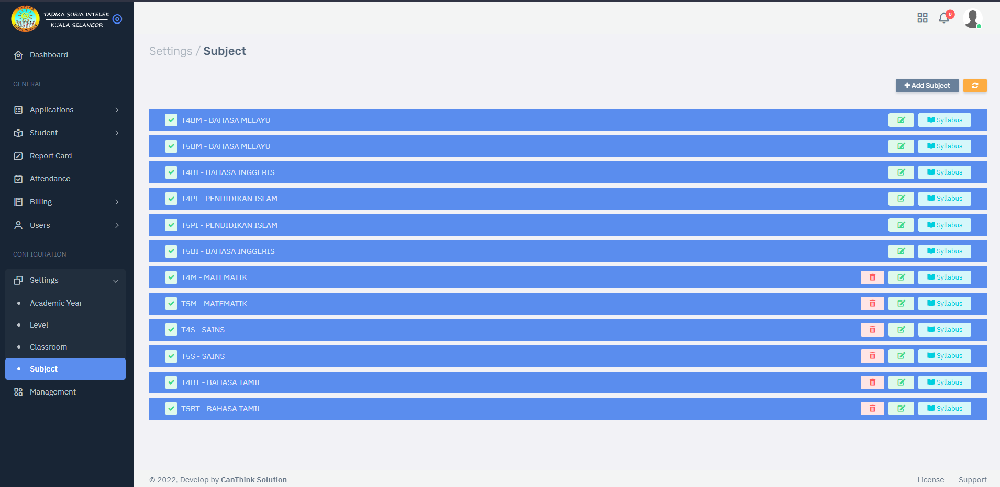
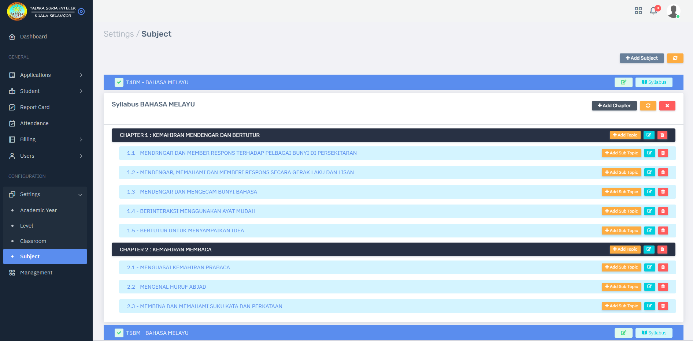

# Tadika Suria Intelek Project

Project Name : Suria Intelek

Client : Student STDC

Year Project : 2022

Requirement System
- PHP 8.0 or above
- MySQL

Framework
- Bootstrap v5.0 (frest template)
- CanThink Framework v0.5 (Custom Framework)

System Description
- Landing Page
- Parent Registration (with email notification)
- Admission Approval
- Parent Portal
- Student Registration
- Student Attendance (using QR Code)
- Student Report Card
- Subject / Syllabus Management
- User Management

URL
- https://suria.canthinksolution.com/

Support
- mfahmyizwan@gmail.com

System Interface

1) Login

2) Student Registration

3) List of application (All)

4) Enrollment

5) Profile student

<i><em> (Modal : Sub-profile use to show billing information, application log, sibling info, academic info) </em></i>

<i><em> (Page : profile use to show current syllabus, attendance report, report card & files cabinet) </em></i>

  
6) Attendance report

7) Report Card

8) Config : Subject

9) Billing

<i><em> 1. List of Invoice </em></i>  

<i><em> 2. Student Invoice with details </em></i>  

10) Parent Portal

<i><em> 1. Parent profile </em></i>  

<i><em> 2. Invoice Payment (billing) </em></i>  

